# 🗂️ Task Manager (Laravel 12)


A collaborative task & project management backend built with Laravel 12,
featuring clean architecture, strict typing, full test coverage, and modern
engineering practices such as CI/CD automation, RabbitMQ-based messaging,
and a robust RBAC authentication system.

---

## 🚀 Features Overview

| Category           | Highlights                                                                           |
|--------------------|--------------------------------------------------------------------------------------|
| **Framework**      | Laravel 12 · Pest · PHPStan · Pint                                                   |
| **Auth**           | JWT with Redis blacklist (secure logout & token invalidation)                        |
| **Access Control** | Policy-based RBAC (Owner/Admin/Member/Viewer)                                        |
| **Validation**     | Form Requests + typed DTOs                                                           |
| **Serialization**  | Consistent API responses via Resource classes                                        |
| **Testing**        | Full endpoint coverage (projects, tasks, labels, members, comments)                  |
| **Messaging**      | RabbitMQ message pipeline (Outbox → Retry → Inbox)                                   |
| **Docs**           | OpenAPI 3.1 + Postman Collection (auto-validated in CI)                              |
| **CI/CD**          | GitHub Actions: lint → static analysis → migrate/seed → parallel tests → docs checks |
| **Runtime**        | Laravel Sail (MySQL, Redis, RabbitMQ)                                                |

---

## ⭐ Tech Highlights

- Clean architecture with DTO + Service layer
- Policy-based RBAC with scoped model binding
- Fully tested APIs using Pest (parallel)
- Production-grade message pipeline (Outbox → Retry → Inbox → DLQ)
- Deployment automation with GitHub Actions + SSH
- Supervisor-managed queue workers
- Redis-backed JWT blacklist for secure logout
- OpenAPI 3.1 documentation with automated validation

---

## ⚙️ Setup & Quick Start

```bash
cp .env.example .env
composer install
./vendor/bin/sail up -d
./vendor/bin/sail artisan key:generate
./vendor/bin/sail artisan jwt:secret --force
./vendor/bin/sail artisan migrate --seed
```

Default stack includes:
- PHP 8.2
- MySQL
- Redis
- RabbitMQ
- Laravel Sail runtime

Reset DB:
```bash
./vendor/bin/sail artisan migrate:fresh --seed
```

---

## 🔐 Auth & Permissions (Overview)

The system uses **JWT authentication + policy-based RBAC**:

| Role       | Permission Summary                  |
|------------|-------------------------------------|
| **Owner**  | Full access; can transfer ownership |
| **Admin**  | Manage members, tasks, labels       |
| **Member** | Work on tasks (CRUD own tasks)      |
| **Viewer** | Read-only                           |

Access control is enforced through:

- **Policies**: ProjectPolicy, TaskPolicy
- **Middleware**: EnsureProjectMember
- **Scoped model binding**: preventing cross-project access

➡️ Full details: [`docs/auth-permissions.md`](docs/auth-permissions.md)

---

## 🧱 Domain Models

User, Project, ProjectMember, Task, Label, TaskComment, TaskLabel
with clean separation between validation (Form Requests), transformation (DTOs),
and serialization (Resources).

➡️ See [`docs/domain-models.md`](docs/domain-models.md) (optional)

---

## 📘 API Documentation

Two documentation formats are provided:

### OpenAPI 3.1

Location: [`docs/openapi/openapi.yaml`](docs/openapi/openapi.yaml)
Visual UI available locally:
- Swagger UI → http://localhost/swagger.html
- Redoc → http://localhost/redoc.html

### Postman Collection

Location: [`docs/postman/task_manager_api.postman_collection.json`](docs/postman/task_manager_api.postman_collection.json)

Includes:
- Auth injection
- Dynamic variables (project_id, task_id, label_id…)
- All endpoint workflows

### Example Workflows

➡️ Moved to: [`docs/api-examples.md`](docs/api-examples.md)

---

## 🧪 Testing

Run all tests (parallel):
```bash
./vendor/bin/sail composer test:parallel
```

Before running tests locally, ensure:

```bash
cp .env.testing.example .env.testing
./vendor/bin/sail up -d
./vendor/bin/sail artisan key:generate --env=testing --force
./vendor/bin/sail artisan jwt:secret --env=testing --force
touch database/testing.sqlite
```

Covers:
- Auth
- Project / Task / Label / Member flows
- Policy boundaries
- JWT blacklist logic
- RabbitMQ Outbox/Inbox pipeline (mocked channel + message)

---

## ⚡ CI/CD

GitHub Actions runs:
- Pint (code style)
- PHPStan (static analysis)
- Migrations + seed (SQLite)
- Redis service
- Pest (parallel tests)
- OpenAPI validation (Redocly + Spectral)
- Postman collection checks

### CI/CD Pipeline Diagram

```mermaid
flowchart LR
    subgraph GitHub["GitHub Actions"]
        A["Push / Pull Request\n(auto CI)"]
        B["CI Jobs\n(Pint · PHPStan · Tests · Docs)"]
        C["Manual Deploy Trigger\n(workflow_dispatch)"]
        D["Deploy Job\nSSH to server"]
    end

    subgraph Server["Production Server"]
        E["deploy.sh\n(update code,\ncomposer install,\nmigrate,\ncache rebuild)"]
        F["Supervisor\nmanages mq:work"]
        G["Cron (www-data)\nruns schedule:run"]
    end

    A --> B
    C --> D --> E

    %% Supervisor and Cron run independently
    E -.-> F
    E -.-> G
```



---

## 📦 Deployment (Overview)

The project includes a lightweight production deployment workflow:

- Manual deployment trigger via GitHub Actions
- Secure SSH deployment to the server
- Server executes a deploy.sh script:
  - Pull latest code
  - Install optimized Composer dependencies
  - Run database migrations
  - Rebuild application caches
- Supervisor manages long-running workers (mq:work)
- Cron (run as www-data) triggers Laravel’s scheduler every minute

➡️ Full deployment flow documentation: [`docs/deployment.md`](docs/deployment.md)

---

## 🔄 Message Pipeline (RabbitMQ)

This project implements a production-grade message pipeline:

Core components:
- Outbox Pattern → durable event storage
- Dispatcher → batched delivery to RabbitMQ
- Retry Exchanges → 10s → 60s → 5m
- Consumer lifecycle（idempotency + version ordering）
- Inbox Pattern → deduplication
- Parking Queue (final DLQ)

➡️ Full architecture: [`docs/message-pipeline.md`](docs/message-pipeline.md)

---

## 🧠 Design Decisions

Focused on testability, strict typing, and maintainability:
- Policies + middleware for clean authorization boundaries
- DTOs for typed input to service layer
- Thin controllers; business logic moved to services
- Resources for consistent JSON output
- Static analysis with PHPStan (Level 6)
- Comprehensive boundary tests

➡️ Full write-up: [`docs/design-decisions.md`](docs/design-decisions.md)

---

## License

MIT License © 2025 [Lv Hui]
For educational and portfolio demonstration purposes only.
